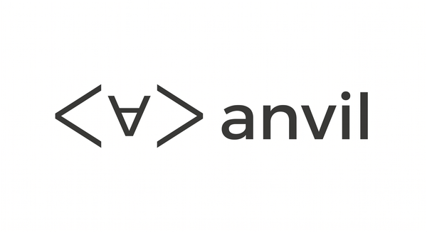
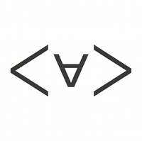

<p align="center">
  
</p>

<p align="center">
  <em>A research-first, evaluation-first inference library.</em>
</p>

<p align="center">
  <a href="docs/design.md">Design&nbsp;manuscript</a> ·
  <a href="#install">Install</a> ·
  <a href="#quickstart">Quickstart</a> ·
  <a href="#milestones">Milestones</a>
</p>

---

> **Status: alpha (v0.3.0).** DoLa contrastive decoding, CaaS LLM tier, MultiTurnFewshot, `Classify` request type, per-request logits processors (vLLM + HF), HiddenStateSpec activation capture, real dataset SHAs in manifests, lm-eval task shim, and CI on Python 3.11/3.12 are all live. CUDA wheels (cu121/cu128/cu130) on GitHub Releases; CPU wheel on PyPI.

## What this is

Anvil is **not** trying to be the fastest inference engine. vLLM and SGLang win throughput. Anvil's identity is correctness, reproducibility, and research ergonomics:

- Every run produces a content-hashed [`Manifest`](src/anvil/manifest/schema.py): two runs with the same manifest must produce identical numbers, byte-for-byte.
- Every chat template, tokenization, sampler, and image input is a versioned, hashed object — not a string loaded from a file at runtime.
- Day-zero new-model coverage via a transformers slow path; popular architectures graduate to a fast path.
- Per-request logits processors and hidden-state extraction are stable public APIs (the V0-vLLM API, restored). DoLa ships out of the box.
- A preflight CaaS agent (rule engine + 15-entry KB + LLM fallback tier) runs before every major run, catches silent failures, and either fixes them or refuses to publish a manifest that crossed a silent regression.

See [`docs/design.md`](docs/design.md) for the full design rationale.

## Install

```bash
uv pip install anvil-eval
```

The CPU wheel ships to PyPI. CUDA wheels (`cu121`, `cu128`, `cu130`) are attached to each [GitHub Release](https://github.com/bishoymoussa/anvil/releases) and can be installed directly:

```bash
# Example: CUDA 12.1
pip install https://github.com/bishoymoussa/anvil/releases/download/v0.3.0/anvil_eval-0.3.0-py3-none-any-cu121.whl
```

> **Import name:** the Python package is still `import anvil` — only the PyPI distribution name is `anvil-eval`.

For development:

```bash
uv venv .venv --python 3.11
source .venv/bin/activate
uv pip install -e ".[dev]"
```

Optional extras: `.[vllm]` for the vLLM backend, `.[multimodal]` for video/audio, `.[xgrammar]` for tool calling.

## Quickstart

```python
import anvil

result = anvil.eval(
    model="meta-llama/Llama-3.1-8B-Instruct",
    tasks=["mmlu", "gsm8k", "humaneval"],
)
print(result.scores)               # {"mmlu": {...}, "gsm8k": {...}, ...}
result.manifest.save("run.json")
```

```bash
# CLI equivalent
anvil eval --model meta-llama/Llama-3.1-8B-Instruct \
           --tasks mmlu,gsm8k,humaneval \
           --output ./run.json

# Verify reproducibility
anvil manifest verify run.json

# Diff two runs to find which fields explain a score gap
anvil manifest diff run.json other.json
```

## DoLa — contrastive decoding out of the box

[DoLa (Chuang et al. 2023)](https://arxiv.org/abs/2309.03883) reduces hallucinations by contrasting logits from late layers vs. early layers at each decoding step. In Anvil it's a drop-in `logits_processor`:

```python
from anvil.research import DoLa
from anvil.primitives import Generate, Sampler

result = engine.generate([
    Generate(
        prompt="The capital of France is",
        sampler=Sampler.greedy(),
        logits_processors=(DoLa(mature_layer=-1, premature_layers=(0, 12, 24)),),
    )
])
print(result[0].text)
```

The engine calls `DoLa.bind(model)` automatically before generation to cache `lm_head.weight`, then runs a step-by-step loop threading hidden states into the processor at every token.

## CaaS preflight agent

Before any major run, Anvil runs a quality sentinel and a preflight check. If the rule engine + KB cannot diagnose the failure, it escalates to the **LLM tier** — a small coder model (Claude Haiku by default) that proposes a structured fix:

```bash
export ANTHROPIC_API_KEY=sk-ant-...
anvil eval --model my-model --tasks mmlu
# [caas/llm-tier] Proposed fix (confidence=0.82):
#   type=set_engine_flag flag=trust_remote_code value=true
#   Rationale: model config requires trust_remote_code=True
# Apply? [y/N]
```

LLM-proposed fixes always require explicit user confirmation. `--caas=ci` mode refuses them by construction. Disable entirely with `ANVIL_LLM_TIER_DISABLED=1`.

## Multi-turn fewshot (instruct models)

Standard single-turn fewshot loses 5–15pp on MMLU for instruct models because the model never sees the pattern of short-answer assistant turns. `MultiTurnFewshot` fixes this by packing each exemplar as its own user/assistant exchange:

```python
from anvil.tasks.base import MultiTurnFewshot

class MyMMLU(MultiTurnFewshot, MMLU):
    name = "mmlu_multiturn"
    # Each fewshot example → user/assistant message pair
    # Final question → user message scored against "A"/"B"/"C"/"D"
```

## Multimodal

```python
from PIL import Image
import anvil

m = anvil.load("Qwen/Qwen2.5-VL-7B-Instruct")
out = m.generate(messages=[{"role": "user", "content": [
    {"type": "image", "image": Image.open("cat.png")},
    {"type": "text",  "text": "What is in this image?"},
]}])
print(out.text)
print(out.image_token_counts)      # per-image vision-token counts
```

## Custom modalities (RNA, audio, embeddings, anything)

```python
from transformers import AutoModel
import anvil

model = anvil.load_custom(
    model_id="multimolecule/rnafm",
    model_class=AutoModel,
)

@anvil.register_task
class RNAFunctionRegression(anvil.Task):
    name = "rna_function_v1"
    dataset = "myorg/rna-function-set"

    def doc_to_request(self, doc):
        return anvil.Embed(input=doc["sequence"], pool="mean", layer=-1)

    def request_to_prediction(self, response, doc):
        return response.embedding

    def aggregate(self, predictions, docs):
        # your metric, your call — Spearman, Ridge probe, anything
        ...

result = anvil.eval(model=model, tasks=["rna_function_v1"])
```

## Migrating from lm-evaluation-harness

```bash
# Before:
lm_eval --model vllm \
    --model_args pretrained=Qwen/Qwen2.5-7B-Instruct \
    --tasks mmlu_pro,arc_challenge \
    --apply_chat_template \
    --num_fewshot 5 \
    --output_path ./out

# After:
anvil eval --model Qwen/Qwen2.5-7B-Instruct \
    --lm-eval-tasks mmlu_pro.yaml,arc_challenge.yaml \
    --n-fewshot 5 \
    --output ./run.json

# Validate the migration:
anvil eval --model Qwen/Qwen2.5-7B-Instruct \
    --lm-eval-tasks arc_challenge.yaml \
    --compare-with-lm-eval \
    --output ./run.json
```

## OpenAI-compatible server

```bash
anvil serve --model Qwen/Qwen2.5-7B-Instruct --port 8000
```

```python
# Drop-in replacement for the OpenAI client:
from openai import OpenAI

client = OpenAI(base_url="http://localhost:8000/v1", api_key="not-checked")
resp = client.chat.completions.create(
    model="Qwen/Qwen2.5-7B-Instruct",
    messages=[{"role": "user", "content": "Hello"}],
)
```

Tool calling is constrained-decoding-driven (one grammar; no per-model `--tool-call-parser` flag matrix).

## Diagnosing your environment

```bash
anvil doctor
# anvil         ok    anvil 0.3.0
# python        ok    Python 3.11.15
# cuda          warn  CUDA not available — torch wheel may not match driver
# transformers  ok    transformers 4.57.6
# vllm          warn  vLLM is not installed
# hf_token      warn  HF_TOKEN is not set
# ...

anvil doctor --json    # machine-readable for CI
```

## Design pillars

1. **Research as a first-class user.** Per-request logits processors (including DoLa), hidden-state extraction, structured output, and custom decoding strategies are stable, versioned public APIs.
2. **Datasets and benchmarks integrate in five lines.** A versioned task spec, batched evaluation primitives that drive the engine at full throughput, and a built-in library of the benchmarks that actually matter.
3. **Day-zero model support, by default.** New HuggingFace architectures load via the transformers backend the day they drop. The top architectures have a fast path.
4. **Reproducibility by construction.** Every run produces a manifest with the model SHA, dataset SHA, chat-template hash, sampler params, library version, and tokenizer version. Two runs with the same manifest produce identical numbers.
5. **CaaS preflight agent.** Rule engine + curated KB + LLM fallback tier runs before every major run, catches silent failures, and surfaces them as a reviewable diff.

## Built-in benchmarks

GSM8K (M0), MMLU + MMLU-MultiTurn + HumanEval+ (M1), MMMU (M4). Tier 2 lm-evaluation-harness imports for the rest of the catalog. Tier 3 custom tasks for any modality.

## Milestones

<p align="left">
  
</p>

- **M0** — HF slow path, GSM8K, manifest emitted.
- **M1** — vLLM wrapper + ChatTemplate canonicalization + MMLU/HumanEval+.
- **M2** — Manifest canonical JSON + sign/verify/diff/replay/strip-caas.
- **M3** — CaaS rule engine + 15-entry KB + 10-case test corpus (70% auto-resolve, 0% false positive).
- **M4** — Multimodal (Qwen2.5-VL fast-path marker + MMMU + VLM-aware preflight).
- **M5** — lm-eval-harness shim + custom non-text modality (RNA example).
- **M6** — uv wheels (cu121/cu128/cu130), 5 fast paths, OpenAI-compatible serve, `anvil doctor`.
- **v0.2.0** — MultiTurnFewshot, Classify request type, HiddenStateSpec, per-request logits processors (HF + vLLM), real dataset SHAs, lm-eval task name resolution.
- **v0.3.0** — DoLa contrastive decoding, CaaS LLM tier (Anthropic + OpenAI-compatible).

## License

Apache-2.0. See [`LICENSE`](LICENSE).

---

<p align="center">
  
  <br />
  <sub><em>Anvil — the same manifest produces the same number, today, tomorrow, and on someone else's machine.</em></sub>
</p>
